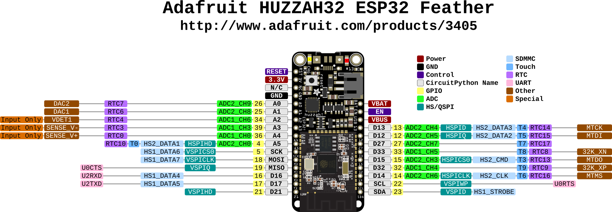
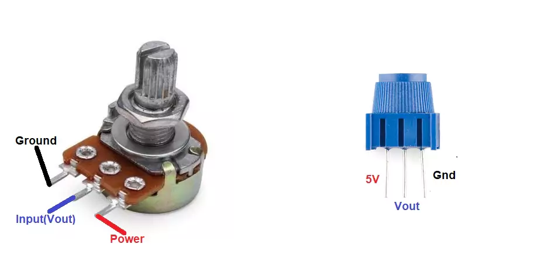
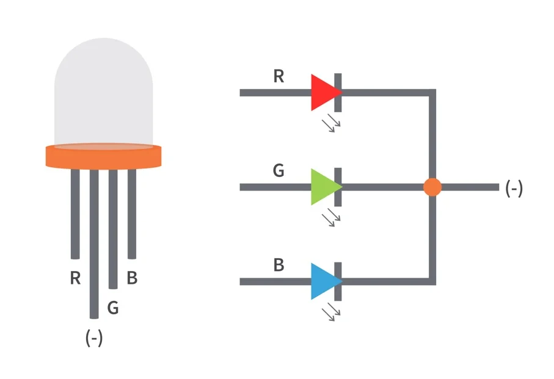

# ESP32 Projects

Welcome to the **ESP32_Projects** repository! This repository contains various projects and experiments using the ESP32 microcontroller.

## Repository Link
[ESP32_Projects Repository](https://github.com/anthle396/ESP32_Projects/tree/main)

## Overview
This repository is dedicated to showcasing different applications and functionalities of the ESP32, including but not limited to:
- IoT Applications
- Sensor Interfacing
- Wireless Communication (Wi-Fi, Bluetooth)
- Low-power Applications
- Real-time Data Processing

## Documentation
Huzzah32 ESP32 Feather Pinout


## Potentiometer Pinout
Potentiometer Pinout


## RGB LEDs and Basic Commands
RGB LED Pinout


This section covers the color scheme for controlling RGB LEDs on the ESP32.
| Q2 (Blue) | Q1 (Green) | Q0 (Red) | Output (Color) |
|-----------|------------|----------|----------------|
| 0         | 0          | 0        | N/A (OFF)      |
| 0         | 0          | 1        | Red            |
| 0         | 1          | 0        | Green          |
| 0         | 1          | 1        | Yellow         |
| 1         | 0          | 0        | Blue           |
| 1         | 0          | 1        | Purple         |
| 1         | 1          | 0        | Teal           |
| 1         | 1          | 1        | White          |


## Getting Started
1. Clone this repository:
   ```bash
   git clone https://github.com/anthle396/ESP32_Projects.git
   ```

## Basic Arduino Code Functions

Below are some basic functions and commands you can use with the Arduino IDE to control the ESP32:

### `pinMode(pin, mode)`
- **Description:** Sets the mode for a specified pin.
- **Parameters:**
  - `pin`: The pin number (e.g., `13`).
  - `mode`: Pin mode (`INPUT`, `OUTPUT`, `INPUT_PULLUP`, `INPUT_PULLDOWN`).

### `digitalWrite(pin, value)`
- **Description:** Writes a HIGH or LOW value to a digital pin.
- **Parameters:**
  - `pin`: The pin number (e.g., `13`).
  - `value`: The value to write (`HIGH` or `LOW`).

### `digitalRead(pin)`
- **Description:** Reads the current state of a digital pin (HIGH or LOW).
- **Parameters:**
  - `pin`: The pin number to read.

### `analogWrite(pin, value)`
- **Description:** Writes an analog value (PWM) to a pin. This function uses pulse width modulation (PWM) to simulate analog output.
- **Parameters:**
  - `pin`: The pin number (e.g., `13`).
  - `value`: The PWM value between 0 and 255.

### `analogRead(pin)`
- **Description:** Reads the value from an analog pin. The ESP32 has a 12-bit ADC (Analog-to-Digital Converter), so it returns a value between 0 and 4095.
- **Parameters:**
  - `pin`: The pin number to read from.

### `delay(ms)`
- **Description:** Pauses the program for a specified amount of time (in milliseconds).
- **Parameters:**
  - `ms`: The time to pause in milliseconds.

### `millis()`
- **Description:** Returns the number of milliseconds since the Arduino board began running the current program.

### `attachInterrupt(digitalPinToInterrupt(pin), ISR, mode)`
- **Description:** Attaches an interrupt to a specified pin.
- **Parameters:**
  - `pin`: The pin number (e.g., `2`).
  - `ISR`: The interrupt service routine to call.
  - `mode`: The mode for the interrupt (`RISING`, `FALLING`, `CHANGE`, or `LOW`).
